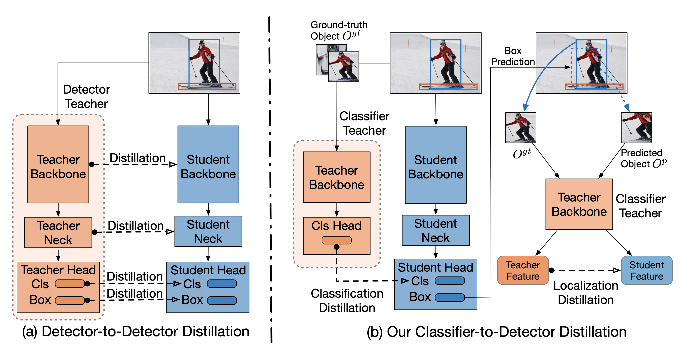

[](https://github.com/NVlabs/SegFormer/blob/master/LICENSE)

This repository is the official PyTorch implementation of training & evaluation code for [Distilling Image Classifiers in Object Detectors](https://arxiv.org/abs/2106.05209), NeuRIPS 2021


# Distilling Image Classifiers in Object Detectors

> Code is in early release and may be subject to change. Please feel free to open an issue in case of questions.

> We use PyTorch and [MMDetection v2.10.0](https://github.com/open-mmlab/mmdetection/tree/v2.10.0) as the codebase. 

## Overview

### [Paper: Distilling Image Classifiers in Object Detectors](https://arxiv.org/abs/2106.05209) 
<!--  -->
<div align="center">
  
</div>
<p align="justify">
  Figure 1: <b> Overview of our classifier-to-detector distillation framework</b>. (a) Existing methods perform distillation across corresponding stages in the teacher and student, which restricts their applicability to detector-to-detector distillation. (b) By contrast, we introduce strategies to transfer the knowledge from an image classification teacher to an object detection student, improving both its recognition and localization accuracy.
</p>


## Environment 
We provide a docker file under the root directory (`[root-dir]`) for better reproducibility. Note that the base image relies access to `nvcr.io`. Then, you need to login to build the docker image. Please see [nvidia-docker](https://github.com/NVIDIA/nvidia-docker) for more information to build and run docker container. 

After the container is alive, please run the following commands to build up our developed MMDetection:

```
pip install -r requirements/build.txt
pip install -v -e .
```

We mainly use NVIDIA Tesla V100 (16 or 32GB) for our experiments. 

## Data 
All experiments are conducted on MS COCO2017. Please download the dataset and make sure you can run a baseline model successfully. More details are [here](https://cocodataset.org/#home). The dataset should be organized as:
```
coco2017
 ├── annotations
 ├── train2017
 ├── val2017
 ├── test2017
```

Note that you need to set the `data_root` in `configs_dev/ssd/ssd300_coco_cls_loc.py`.


## Pre-trained Classification Teacher
We provide the pre-trained classification teacher model for SSD300, which is ResNet50 trained on COCO2017 classification dataset. Please download it first from [Drive](https://drive.google.com/file/d/1X8gO-dkl5O_VLOFKCF8IuAkNtDQf53ie/view?usp=sharing) and unzip it to  `[root-dir]/cls_teachers/ssd/`.  The details of building up the classification dataset and training the teachers are in the supplementary material Section S2.

## Training
To train a model, run training script under the `[root-dir]`. 

### SSD300 example
```
bash ./tools/dist_train_cls_loc.sh \
      configs_dev/ssd/ssd300_coco_cls_loc.py \ # configuration file
      8 # num of gpus
```

This will reproduce the result of SSD300 in Table 1 in the main paper:

Table A: Results of our classifier-to-detector distillation with SSD300 on the COCO2017 validation set.

|           Model 	|     mAP	|  
|----------------:	|:------------:	|
|        SSD300-VGG16 	| 25.6 	      | 
|       + Ours 	      | 27.9 	      | 


## Evaluation
The trained SSD300 model can be evaluated as follow:
```
# single gpu
python ./tools/test.py \
       configs/ssd/ssd300.py \
       [checkpoint.pth] \
       --eval bbox

# multiple gpus
bash ./tools/dist_test.sh \
       configs/ssd/ssd300.py \
       [checkpoint.pth] \
       8 # num of gpus
```

## License
Please check the [LICENSE](https://github.com/NVlabs/DICOD/blob/master/LICENSE) file. This work may be used non-commercially, meaning for research or 
evaluation purposes only. For business inquiries, please contact 
[researchinquiries@nvidia.com](mailto:researchinquiries@nvidia.com).


## Citation
```
@article{guo2021distilling,
         title={Distilling Image Classifiers in Object Detectors}, 
         author={Shuxuan Guo and Jose M. Alvarez and Mathieu Salzmann},
         year={2021},
         eprint={2106.05209},
         archivePrefix={arXiv},
         primaryClass={cs.CV}
}
```


